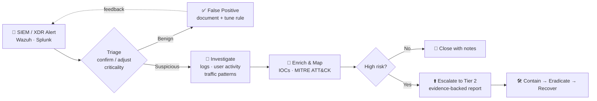

<!-- ═══════════════════════════  HEADER  ═══════════════════════════ -->
<div align="center">


<a href="https://git.io/typing-svg"></a>

<p>


</p>

<p>
<a href="https://www.linkedin.com/in/deepesh-mahawar/"></a>
<a href="mailto:deepeshmahawar2006@gmail.com"></a>
<a href="https://tryhackme.com/p/deepeshmaha2006"></a>
<a href="https://leetcode.com/u/deeponworkattime/"></a>

</p>

</div>

---

## 🛡️ `$ whoami`

```yaml
analyst:
  name        : Deepesh Kumar Mahawar
  role        : SOC Analyst (Tier 1 / L1) · Cybersecurity Analyst
  location    : Jaipur, Rajasthan, India  (IST, UTC+05:30)
  education   : B.Tech CSE (Cyber Security) — Poornima College of Engineering, Jaipur (NAAC A+, RTU Kota)
  grades      : CGPA 7.59/10 · rising trend → Sem III SGPA 8.44 → Sem IV SGPA 9.21
  graduating  : Apr 2028 (expected)
  focus       : [ Alert Triage, Log Analysis, Threat Detection, Incident Response, Web App Pentesting ]
  frameworks  : [ MITRE ATT&CK, OWASP Top 10, CVSS, NIST IR Lifecycle ]
  looking_for : SOC Analyst / Security Analyst roles — in-house SOC, MSSP or MDR
```

I'm a cybersecurity undergraduate who works on the blue team with a red-team background. I **monitor, triage and escalate**: confirming or adjusting alert criticality, enriching events with context, filtering out false positives and handing real incidents to Tier 2 with clear, evidence-backed write-ups. My web-app pentesting background (OWASP Top 10, Burp Suite, Metasploit) means I know what an attack looks like *before* it shows up in the logs.

<div align="center">

| 🎯 **40%** | 🎣 **94.7%** | 🧪 **430+** | 🏁 **Top 2%** | 💻 **783** |
|:--:|:--:|:--:|:--:|:--:|
| less manual alert triage<br/><sub>FraudShield</sub> | phishing detection accuracy<br/><sub>PhishGuard</sub> | automated tests<br/><sub>HydraX</sub> | TryHackMe globally<br/><sub>121 rooms · 25 badges</sub> | LeetCode problems<br/><sub>solved</sub> |

</div>

---

## 🔁 `$ cat soc_playbook.md` — how I handle an alert



---

## 💼 `$ cat experience.log`

```diff
+ [JUN 2026 – JUL 2026]  Cyber Security Intern — Bright Hub Pvt Ltd, Jaipur
  › Identified SQLi & XSS attack vectors in lab web apps through VAPT (OWASP Top 10, Burp Suite)
  › Analysed intercepted HTTP/HTTPS traffic to isolate malicious payloads — the activity a SOC flags in WAF logs
  › Documented findings with CVSS severity, evidence & remediation → escalation-ready incident reports

+ [JUN 2025 – JUL 2025]  Web Development Intern (Secure Coding) — Renao Robotics Pvt Ltd, Jaipur
  › Security-audited a production web app and closed 5+ gaps (exposed API keys, missing input validation), zero regressions
  › Enforced Content Security Policy, sanitized input, XSS-safe DOM handling, parameterized Node.js/MySQL queries
  › Shipped 3+ React interfaces in Git-based Agile sprints with OWASP Top 10 controls in place
```

---

## 🧰 `$ ls ./projects/ --sort=impact`

<details open>
<summary><b>🐍 HydraX — Bug Bounty Automation Platform</b> &nbsp;·&nbsp; <code>Python · FastAPI · PostgreSQL · Celery · Docker</code></summary>
<br/>

- **25 scanner modules** (XSS, SQLi, SSRF, IDOR, XXE, API security) mapped to OWASP Top 10, on a threaded scan engine with circuit breaker, adaptive rate limiting and Nmap / Nuclei / Nikto integration
- **Alert-fatigue control:** findings tiered into *confirmed / possible / info* using baseline-controlled evidence, prioritised with a **0–100 risk score** from 5 weighted factors, plus SOAR-style webhook escalation
- Multi-tenant backend correlates telemetry from signed connector agents → CWE-mapped reports (HTML · JSON · **SARIF**), backed by **430+ tests** and a CI pipeline with **Bandit, Gitleaks, Trivy**

</details>

<details open>
<summary><b>🛡️ <a href="https://github.com/deepmaha2006/FraudShield">FraudShield</a> — Real-Time Anomaly Detection & Alert Escalation Engine</b> &nbsp;·&nbsp; <code>Python · Node.js · SQLite · OCR</code></summary>
<br/>

- SIEM-style correlation and detection rules flagged high-risk KYC cases across **500+ records at ~91% accuracy**
- SOC-style alert dashboard fed by 3 classifiers → **40% less manual triage**, alert response **under 60 seconds**
- 🏆 **Smart India Hackathon 2025 national nominee** (Team Drishti), presented to a 5-member evaluation panel

</details>

<details>
<summary><b>🎣 <a href="https://github.com/deepmaha2006/PhishGuard">PhishGuard</a> — Phishing URL Detection Tool</b> &nbsp;·&nbsp; <code>Python</code></summary>
<br/>

- **94.7% accuracy · 93.2% precision · 96.1% recall · F1 94.6%** against PhishTank and DMOZ samples
- 20+ heuristic indicators: domain entropy, brand spoofing, URL shorteners, IP-based hosts, risky TLDs
- 0–100 risk score with per-indicator breakdown and bulk JSON export; runs fully offline with no third-party APIs

</details>

<details>
<summary><b>📡 Wazuh SIEM Home Lab</b> &nbsp;·&nbsp; <code>Wazuh · Linux</code></summary>
<br/>

- Deployed a Wazuh manager and agents for centralised visibility into endpoint and authentication logs
- Practised Tier 1 triage, false-positive review and escalation notes mapped to MITRE ATT&CK

</details>

<details>
<summary><b>💉 <a href="https://github.com/deepmaha2006/SQLShield">SQLShield</a> — SQL Injection Scanner</b> &nbsp;·&nbsp; <code>Python</code></summary>
<br/>

- **85+ payloads** across 5 techniques (error, boolean, time, UNION, comment-based) with MySQL, PostgreSQL, MSSQL and Oracle variants
- Findings rated High / Medium / Low in JSON reports

</details>

<details>
<summary><b>🌐 <a href="https://github.com/deepmaha2006/NetSentinel">NetSentinel</a> — Asynchronous Port Scanner</b> &nbsp;·&nbsp; <code>C++20 · Boost.Asio · CMake</code></summary>
<br/>

- Non-blocking TCP scanner: open / closed / filtered classification, banner grabbing, 40+ well-known service mappings for attack-surface discovery

</details>

<details>
<summary><b>🔐 <a href="https://github.com/deepmaha2006/SecureVault">SecureVault</a> — Local Password Manager</b> &nbsp;·&nbsp; <code>Python · Flask · JavaScript</code></summary>
<br/>

- Fernet (AES-128-CBC + HMAC-SHA256) encryption with PBKDF2-HMAC-SHA256 key derivation at **480,000 iterations**
- Secure password generation and live strength analysis; all data stays on-device

</details>

<div align="center">
<sub>▸ click any project to expand / collapse</sub>
</div>

---

## ⚔️ `$ cat ./arsenal.conf`

<table>
<tr>
<td width="50%" valign="top">

**🔵 Blue Team — Detect & Respond**


<sub>Alert triage & prioritisation · event correlation · detection rules · log & traffic analysis · phishing analysis · incident documentation · escalation</sub>

</td>
<td width="50%" valign="top">

**🔴 Red Team — Assess & Exploit**


<sub>OWASP Top 10 · CVSS scoring · privilege escalation · Active Directory (labs) · OSINT · attack-surface mapping</sub>

</td>
</tr>
<tr>
<td valign="top">

**☁️ Cloud & DevSecOps**


</td>
<td valign="top">

**💻 Code & Data**


</td>
</tr>
</table>

---

## 📜 `$ cat ./certifications.log`

<details open>
<summary><b>🔐 Cybersecurity</b></summary>

| Certification | Issuer | Date |
|---|---|:--:|
| **Ethical Hacker** | Cisco Networking Academy | Apr 2026 |
| Introduction to Cybersecurity | Cisco Networking Academy | Apr 2026 |
| Cyber Job Simulation | Deloitte (Forage) | May 2026 |
| Cybersecurity Analyst Job Simulation — Identity & Access Management | Tata Group (Forage) | May 2026 |
| Introduction to Python for Defensive Security | Red Team Leaders | Jun 2026 |
| Introduction to Penetration Testing | Centri | Jun 2026 |
| Introduction to Critical Infrastructure Protection | OPSWAT Academy | Jul 2026 |

</details>

<details>
<summary><b>☁️ Cloud & DevOps</b></summary>

| Certification | Issuer | Date |
|---|---|:--:|
| AWS Cloud Practitioner Essentials | Amazon Web Services | Apr 2026 |
| Introduction to Cloud Infrastructure: Describe Cloud Concepts | Microsoft Learn | Apr 2026 |
| Modern DevOps Practices | 8Bit System / Poornima College of Engineering | Feb 2026 |

</details>

<details>
<summary><b>📊 Risk, Data & AI</b></summary>

| Certification | Issuer | Date |
|---|---|:--:|
| Internal Audit Job Simulation — Risk Assessment | Goldman Sachs (Forage) | May 2026 |
| Data Analyst — Big 4 Ready | OneRoadmap | May 2026 |
| Career Essentials in Generative AI | Microsoft & LinkedIn | Apr 2026 |
| AI Fluency: Framework & Foundations | Anthropic | Apr 2026 |
| Introduction to Model Context Protocol | Anthropic | Apr 2026 |
| Design Thinking — A Primer | NPTEL, IIT Madras | Aug 2025 |

</details>

---

## 🏆 `$ cat ./achievements.log`

```diff
+ [SEP 2025] 🏅 Smart India Hackathon 2025 — National Nominee (Team Drishti, Poornima College IIC)
             → FraudShield: anomaly detection & alert escalation engine
+ [ONGOING ] 🚩 TryHackMe — [0xD][LEGEND] · Top 2% globally · Rank #36,596 · 121 rooms · 25 badges
+ [JAN 2026] 🧑‍💻 LNMHACKS 8.0 @ LNMIIT — Team Leader
             → stock prediction platform with blockchain-backed immutable audit trail
+ [FEB 2025] 🥉 AADHAR'13 Tech-Fest — 3rd Place, Micro Mouse (autonomous maze-solving robot)
+ [ONGOING ] 🧠 LeetCode — 783 problems solved
```

<div align="center">

### 🚩 TryHackMe — `[0xD][LEGEND]`

| 🏆 Global Rank | 📊 Percentile | 🚪 Rooms Completed | 🎖️ Badges | 🔥 Streak |
|:--:|:--:|:--:|:--:|:--:|
| **#23,482** | **Top 1%** | **158** | **27** | **21 days** |

<a href="https://tryhackme.com/p/deepeshmaha2006">


</a>

<sub>SOC · Blue Team · Offensive Security content</sub>

</div>

---

## 📈 `$ git log --stats`

<div align="center">


<picture>
  <source media="(prefers-color-scheme: dark)" srcset="https://raw.githubusercontent.com/deepmaha2006/deepmaha2006/output/pacman-contribution-graph-dark.svg">
  <source media="(prefers-color-scheme: light)" srcset="https://raw.githubusercontent.com/deepmaha2006/deepmaha2006/output/pacman-contribution-graph.svg">
  
</picture>

</div>

---

## 📡 `$ ./connect.sh`

<div align="center">

[](https://www.linkedin.com/in/deepesh-mahawar/)
[](mailto:deepeshmahawar2006@gmail.com)
[](https://tryhackme.com/p/deepeshmaha2006)
[](https://leetcode.com/u/deeponworkattime/)

```text
[ STATUS  ] ● online  — open to SOC Analyst / Security Analyst roles & internships
[ MISSION ] detect early · triage fast · escalate with evidence
[ MOTTO   ] think like an attacker, defend like an analyst
```


</div>
